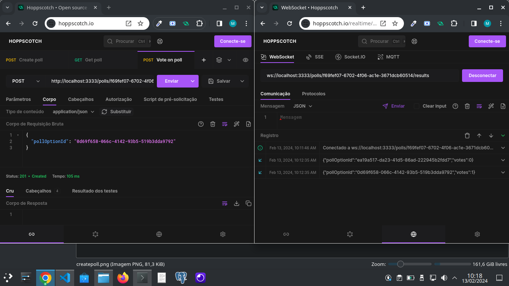

# NLW Expert (Node.js)

A real-time voting system where users can create a poll and other users can cast their votes. The system generates a ranking among the options and updates the votes in real-time.

## Screenshots



## Requisites

- Docker;
- Node.js;

## Setup

- Clone the repository;
- Install dependencies (`npm install`);
- Setup PostgreSQL and Redis (`docker compose up -d`);
- Copy `.env.example` file (`cp .env.example .env`);
- Run application (`npm run dev`);
- Test it! (I personally recommend testing with [Hoppscotch](https://hoppscotch.io/)).

## HTTP

### POST `/polls`

Create a new poll.

#### Request body

```json
{
  "title": "Qual o melhor framework Node.js?",
  "options": [
    "Express",
    "Fastify",
    "NestJS",
    "HapiJS"
  ]
}
```

#### Response body

```json
{
  "pollId": "f69fef07-6702-4f06-ac1e-3671dcb60514"
}
```

### GET `/polls/:pollId`

Return data from a single poll.

#### Response body

```json
{
   "poll":{
      "id":"f69fef07-6702-4f06-ac1e-3671dcb60514",
      "title":"Qual o melhor framework Node.js?",
      "options":[
         {
            "id":"ea19a517-da23-41d5-86ad-222945b2fdd7",
            "title":"Express",
            "score":0
         },
         {
            "id":"0d69f658-066c-4142-93b5-519b3dda9792",
            "title":"Fastify",
            "score":1
         },
         {
            "id":"1ad6b046-9fc3-425f-ad8c-dcaccbde7b69",
            "title":"NestJS",
            "score":0
         },
         {
            "id":"45344819-8faf-4076-b9fb-d5d11fccc5d8",
            "title":"HapiJS",
            "score":0
         }
      ]
   }
}
```

### POST `/polls/:pollId/votes`

Add a vote to specific poll.

#### Request body

```json
{
  "pollOptionId": "0d69f658-066c-4142-93b5-519b3dda9792"
}
```

## WebSockets

### ws `/polls/:pollId/results`

#### Message

```json
{
  "pollOptionId": "0d69f658-066c-4142-93b5-519b3dda9792",
  "votes": 1
}
```
<!--START_SECTION:footer-->
<!--END_SECTION:footer-->
